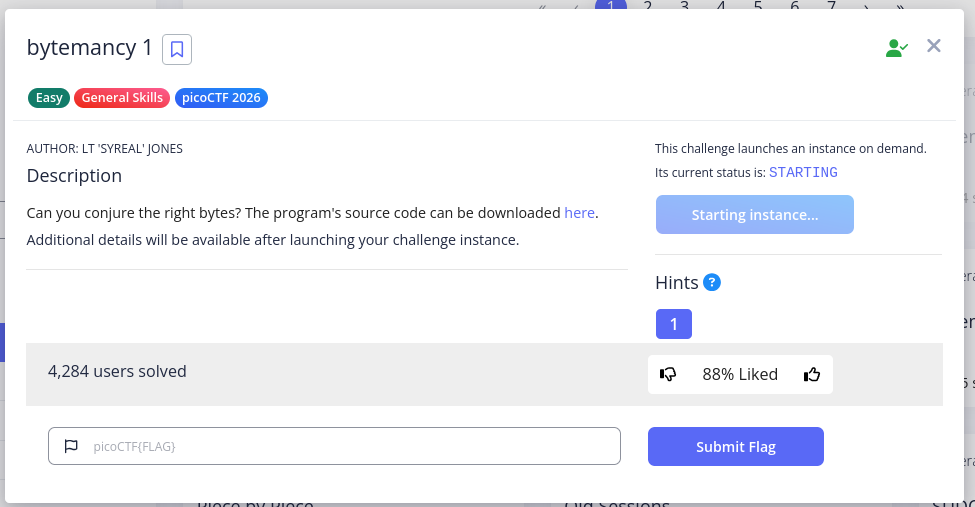
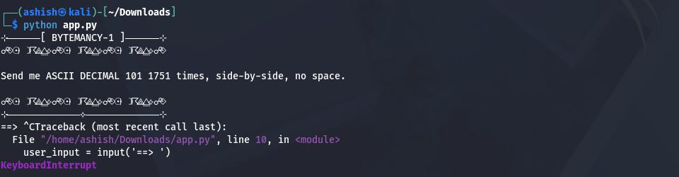
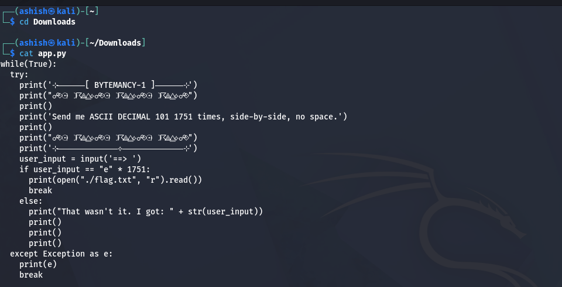
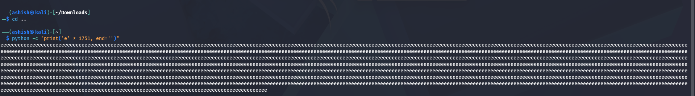
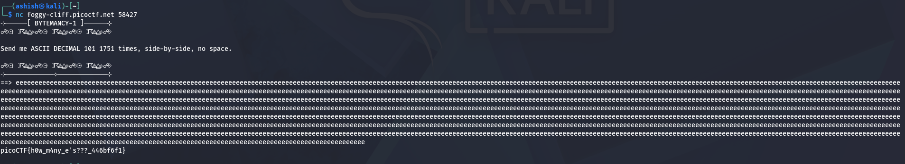

# 🔐 picoCTF – Bytemancy (1) Write-Up

## 📌 Challenge Info
- **CTF:** :contentReference[oaicite:0]{index=0}  
- **Author:** :contentReference[oaicite:1]{index=1}  
- **Category:** General Skills / Scripting  
- **Difficulty:** Easy  

---

## 🧠 Concept Tested
- :contentReference[oaicite:2]{index=2} values  
- Reading source code  
- Automating repetitive input  
- Basic scripting with Python  

---

## ⚙️ Bytemancy 1

### Source Code


### App Script Execution


### App.py



## 🔍 Analysis

This challenge follows the **same logic** as Bytemancy 0.

### 🔁 Key Change:
- Required repetition increased to **1751 times**

---

## 💡 Solution

ASCII value **101 = 'e'**

So the required input is:

```bash
'e' repeated 1751 times
⚡ Input Generation

Instead of typing manually, use:

python -c "print('e' * 1751, end='')"
```
### Input Generation


### Final Output

