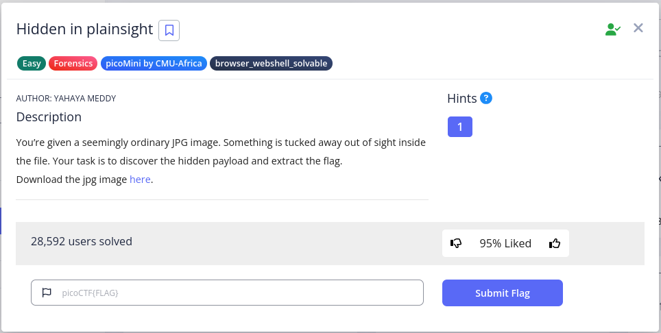
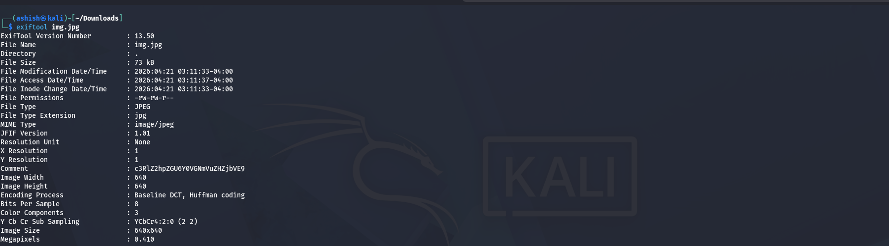
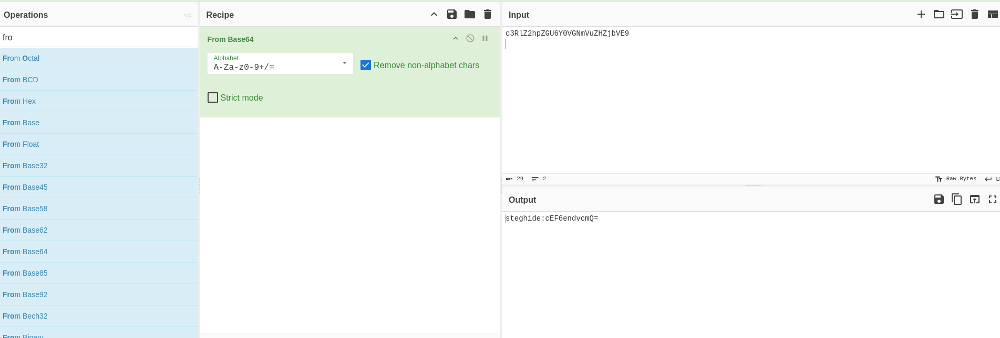
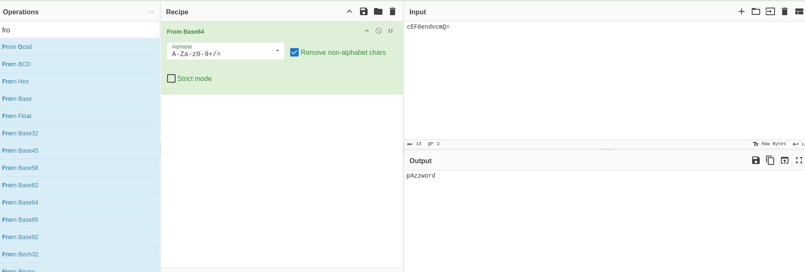
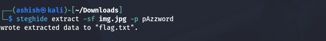
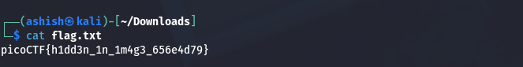

# 🔍 Hidden in Plain Sight – CTF Write-Up

**Author:** Yahaya Meddy

---

## 📌 Challenge Description

You’re given a seemingly ordinary `.jpg` image. At first glance, nothing looks unusual. However, the challenge hints that something is hidden within the file.

Your objective:

* Identify hidden data inside the image
* Extract the hidden payload
* Retrieve the flag

---
### Question


## 🛠️ Tools Used

* `exiftool` – for metadata analysis
* `CyberChef` – for Base64 decoding
* `steghide` – for extracting hidden files
* `cat` – to read the final flag

---

## 🚀 Step-by-Step Solution

### 1️⃣ Inspect Image Metadata

Start by analyzing the image metadata:

```bash
exiftool img.jpg
```
### Exiftool

🔎 Observation:

* Found a **Base64 encoded string** in the comment field

---

### 2️⃣ Decode Base64 (Layer 1)

* Copy the Base64 string
* Decode it using CyberChef or any Base64 decoder

📌 Result:

* Another Base64 string appears

---
### Layer 1

### 3️⃣ Decode Base64 (Layer 2)

* Decode the second Base64 string
### Layer 2


📌 Output:

```
pAzzword
```

👉 This is the password for the next step

---

### 4️⃣ Extract Hidden Data

Use `steghide` with the discovered password:

```bash
steghide extract -sf img.jpg -p pAzzword
```
### Steghide


📂 Output:

* A file named `flag.txt` is extracted

---

### 5️⃣ Retrieve the Flag

```bash
cat flag.txt
```
### Final Output


🎉 Flag successfully obtained!

---

## 🧠 Key Learnings

* Always check **metadata** first
* Multiple layers of encoding are common in CTFs
* Don’t ignore **obvious clues like passwords**
* Use the right tool instead of guessing randomly
* Logical thinking beats brute force

---

## 📁 File Structure

```
.
├── Images
└── README.md
```

---

## ⚠️ Common Mistakes

* Skipping metadata analysis
* Decoding Base64 only once
* Ignoring extracted hints
* Trying unnecessary brute-force attacks

---

## 🏁 Conclusion

This challenge demonstrates how data can be hidden in plain sight using:

* Metadata manipulation
* Encoding layers
* Steganography

A structured approach makes the solution straightforward, while random attempts lead nowhere.

---

## 🔗 Credits

* Challenge Author: **Yahaya Meddy**
* Tools: exiftool, CyberChef, steghide

---

💡 *Lesson: If it looks normal, inspect it twice.*
