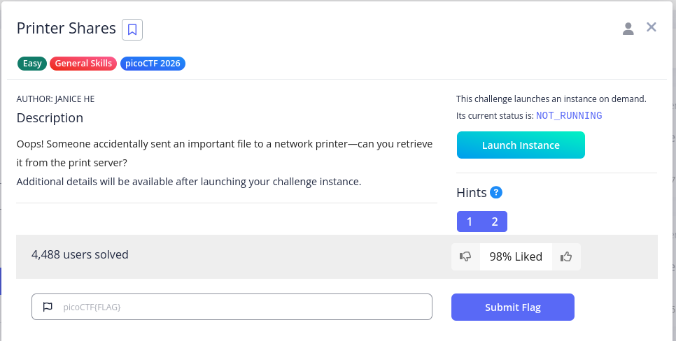
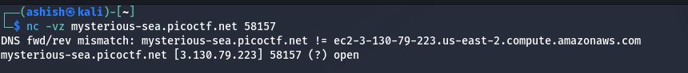
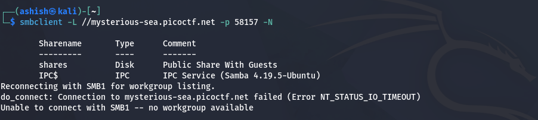
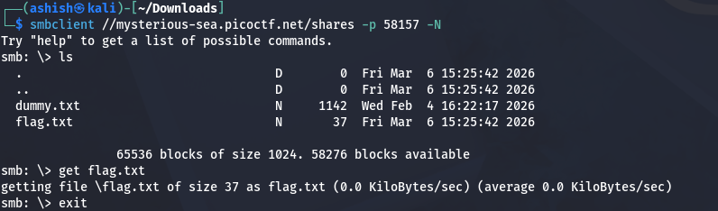
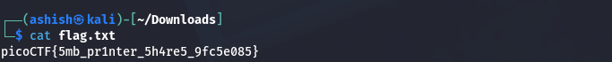

# 🖨️ picoCTF Write-Up: Printer Shares

## 🔍 Challenge Details

- **Challenge Name:** Printer Shares  
- **Author:** Janice He  
- **Category:** Networking / SMB  

**Description:**  
> Oops! Someone accidentally sent an important file to a network printer—can you retrieve it from the print server?

---

## 🎯 Objective

Enumerate the target, identify SMB shares, access them anonymously, and retrieve the flag.

---
### Source


## ⚙️ Step 1: Initial Connection

```bash
nc -vz mysterious-sea.picoctf.net 58157
```
Used to verify the service is running and reachable.
### Netcat Connection


## 🧠 Concept: SMB (Server Message Block)
Protocol used for file and printer sharing
Common in Windows systems
Misconfigured shares can allow anonymous access
## 🛠️ Tool Used
## smbclient

Command-line tool to interact with SMB shares.

## 🔎 Step 2: Enumerate SMB Shares
```bash
smbclient -L //mysterious-sea.picoctf.net -p 58157 -N
```
Explanation:

-L → List shares
-p 54397 → Target port
-N → No password (anonymous login)
### SMBCLIENT

## 🔐 Step 3: Connect to Share
```bash
smbclient  //mysterious-sea.picoctf.net/shares -p 58157 -N
```
### Connection

## 📂 Step 4: List Files
ls

Output:

flag.txt
## 📥 Step 5: Download Flag
get flag.txt
## 🚪 Step 6: Exit
exit
## 🏁 Step 7: View Flag
cat flag.txt
### Final Output

## 💡 Key Takeaways
Always perform enumeration first
SMB shares may allow anonymous access
Check non-default ports
Use appropriate tools instead of guessing
## ⚠️ Common Mistakes
Skipping enumeration
Ignoring port numbers
Lack of understanding of SMB
## 🚀 Conclusion

This challenge demonstrates how exposed SMB shares can lead to sensitive data exposure. Proper enumeration and basic tool usage are sufficient to retrieve the flag.

## 📁 Commands Summary
```bash
nc -vz mysterious-sea.picoctf.net 58157

smbclient -L //mysterious-sea.picoctf.net -p 58157 -N
smbclient  //mysterious-sea.picoctf.net/shares -p 58157 -N

ls
get flag.txt
exit

cat flag.txt
```
